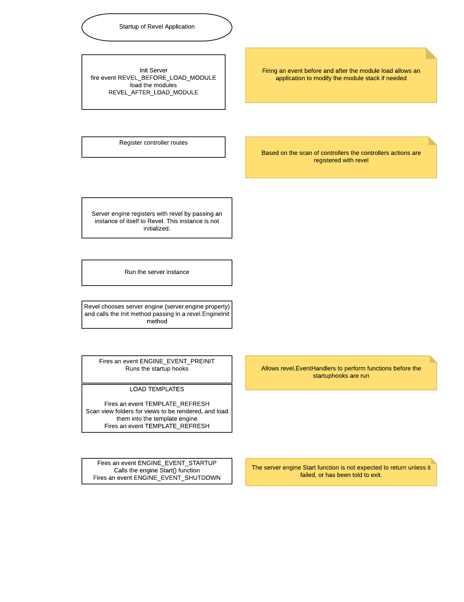
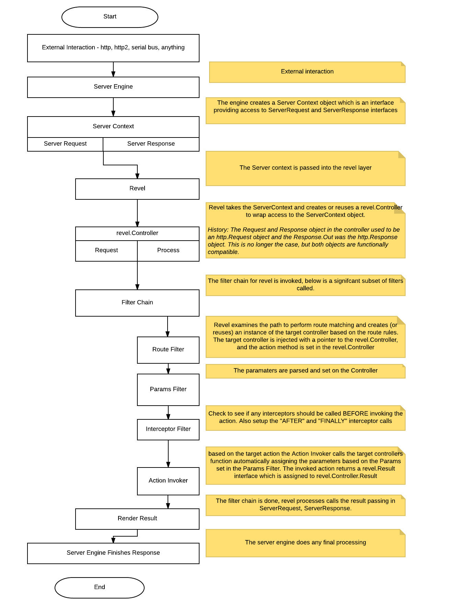

**Revel** is almost a full stack web framework in the spirit of 
[Rails](http://rubyonrails.org/) and [Play!](http://www.playframework.org) frameworks.

- Many  *proven* ideas are incorporated into the framework, its design and interface
- Also using [golang](https://golang.org/), it's also hackable ;-)

Revel attempts to make it easy to build web applications using the [Model-View-Controller
(MVC)](http://en.wikipedia.org/wiki/Model%E2%80%93view%E2%80%93controller)
pattern by relying on conventions that require a certain structure in an
application.  In return, it is very light on [configuration](appconf.html) 
and enables an extremely fast development cycle.

Revel is very customizable, you can plug in your own [template system](template-engine)
or even a custom [http server engine](server-engine). It is the perfect middleware that
is designed to work out of the box and provide the ability to implement almost any application.

## MVC

Here is a quick summary:

- **Models** are the essential data objects that describe your application domain.
   Models also contain domain-specific logic for querying and updating the data.
- **Views** describe how data is presented and manipulated. In our case, this is
   the [template](templates.html) that is used to [present data](results.html) and controls to the user.
- **Controllers** handle the request execution.  They perform the user's desired
   action, they decide which View to display, and they prepare and provide the
   necessary data to the View for rendering.

A detailed overview of the MVC approach is beyond the scope of this guide.

## Revel Startup
An event model has been added to revel to make it easier to provide additional control
to the application. Events can be added by calling
`revel.AddInitEventHandler(func(event int, value interface{}) (r int) {})`
The event ID's are called  in the following sequence

## The Life of a Request

Below is an overview of the request processing framework:

* Revel contains a [Server Engine](server-engine.html) interface. It allows a developer to build their own "engine" 
to communicate to the MVC architecture of Revel. By default a single Go http.Server gets created to handle http.Requests. 
 * A  [revel.Controller](controllers.html) ( which is the context for the request) is populated and the request 
 is passed to the 
  [Filter chain](filters.html).
* [Filters](filters.html) are links in a request processing chain. They will
  implement horizontal concerns like request logging, cookie policies,
  authorization, etc.  Most of Revel's built-in functionality are implemented as
  [Filters](filters.html).
* Actions are the application-specific controller and method that process the input and
  produce a [Result](results.html). An Action is defined as the controller name and method name. 
  For example "App.Index" is an action

## Server Engine

Revel allows the developer to build their own [Server Engine](server-engine.html). It comes with Go's http.Server
out of the box which works great for building up your project. However in production you may need more control so
you can replace it (see modules/serverengine/fasthttp) or extend it (see modules/serverengine/newrelic).
  
Revel's Server Engine can handle multiple go-routine
(lightweight thread) to process each incoming request.  The implication is that
your code is free to block, but it must handle concurrent request processing.

When a request is received (through the EngineInit.Callback) it is composed into a revel.Controller which is passed to the [Filter chain](filters.html) for
processing and, upon completion, apply the [result](results.html) to write the response.

By default, the GoEngine will be registered at the `"/"` url to receive all
incoming connections.  However, applications are free to override this behavior
-- for example, they may want to use existing http.Handlers rather than
re-implementing them within the Revel framework.  See the [FAQ](faq.html) for
more detail.

## Filters

[Filters](filters.html) implement most request processing functionality provided
by Revel. They have a simple interface that allows them to be nested.

The "Filter Chain" is an array of functions, each one invoking the next, until
the terminal filter stage invokes the action.  For example, one of the first
Filters in the chain is the [RouterFilter](https://godoc.org/github.com/revel/revel#RouterFilter), 
which decides which Action the request is meant for and creates that controller.

Overall, Filters and the Filter Chain are the equivalent of Rack.

## Namespace, Controllers and Methods

Each request invokes an **action**. An action is defined as the combination of a 
Controller Name and a Controller Method. For example "App.Index" is an action. An
action may also include a namespace like `static\App.Index` ([Namespaces](namespace.html)
are used to prevent duplicate actions when using a module). This action 
handles the request and writes the response. 

Good program practice would group related methods into one [**controllers**](controllers.html).  
The [Controller](https://godoc.org/github.com/revel/revel#Controller) type contains relevant
fields and methods and acts as the context for each request.

As part of handling the request, Revel instantiates an instance of a
[Controller](https://godoc.org/github.com/revel/revel#Controller), and it sets all of these properties on the embedded
`Controller`.  Revel does not share `Controller` instances between requests (but it will reuse them).

A **Controller** is any type that embeds [*revel.Controller](https://godoc.org/github.com/revel/revel#Controller) (directly or indirectly).

type MyAppController struct {
    *revel.Controller
}


A **Action Method** is any method on a **Controller** that meets the following criteria:

* is exported
* returns a [revel.Result](results.html)

For example:

func (c MyAppController) ShowLogin(username string) revel.Result {
	..
	return c.Render(username)
}


The example invokes `Controller.Render()` to execute a [template](templates.html), passing it the
username as a parameter.  There are many methods on a 
[Controller](https://godoc.org/github.com/revel/revel#Controller) that
produce [Result](https://godoc.org/github.com/revel/revel#Result); 
but applications are also free to [create their own custom result](results.html#CustomResult).

## Results

A Result is anything conforming to the interface:

type Result interface {
	Apply(req *Request, resp *Response)
}


Typically, nothing is written to the response until the **action** and all
[filters](filters.html) have returned.  At that point, Revel writes response headers and cookies
(e.g. setting the [session](sessionflash.html) cookie), and then invokes `Result.Apply` to write the
actual response content.
